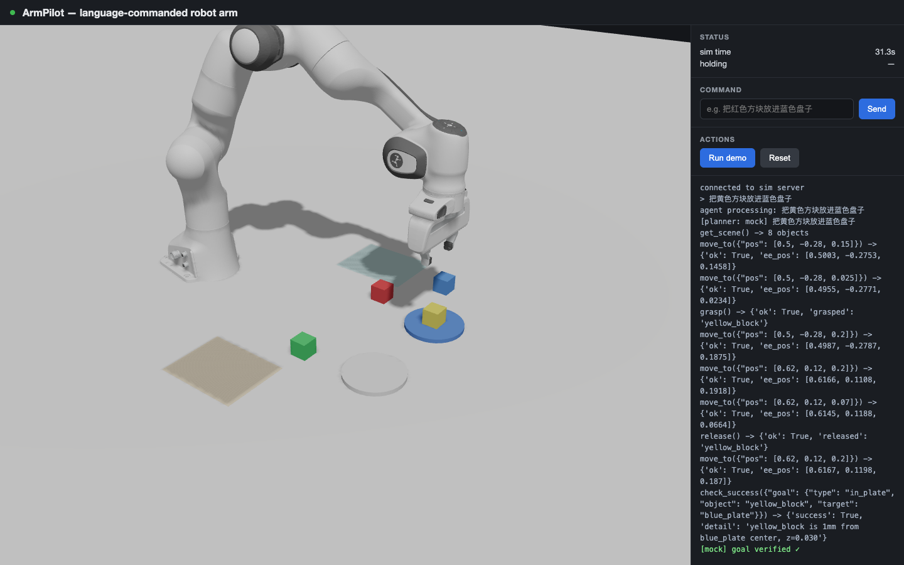

# ArmPilot — language-commanded robot arm in your browser

Type a natural-language command (中文 or English), an LLM agent plans it into discrete
motion primitives, a MuJoCo-simulated Franka Panda executes them, and you watch it live
in the browser at 30 fps.

```
"把红色方块放进蓝色盘子"  →  plan → move → grasp → move → release → verify ✓
```



## Architecture

```
 Browser (Next.js + react-three-fiber, :3100)
   │  WebSocket  ── scene_init (geoms + mesh data, once)
   │             ── frame (world poses, 30 Hz)
   │             ── agent_event / status / done
   ▼
 Backend (FastAPI, :8000)
   ├─ Agent layer        armpilot/agent.py
   │    ClaudePlanner — Anthropic tool-calling loop (needs ANTHROPIC_API_KEY)
   │    MockPlanner   — deterministic zh/en parser, same tool surface
   │    tools: get_scene · move_to(pos) · grasp · release · check_success(goal)
   ├─ Primitive layer    armpilot/sim.py
   │    DLS IK (ik.py) + position actuators, cosine-eased joint interpolation
   └─ Physics            MuJoCo 3.x, Franka Panda from mujoco_menagerie
        4 colored blocks · 2 plates · 2 zones, 500 Hz timestep
```

The key boundary: **the LLM only does discrete task planning; it never does continuous
control.** Tool calls are macroscopic ("move TCP to [x,y,z]"); inverse kinematics and
trajectory interpolation are classical code. This mirrors how production systems
(Figure Helix, SayCan) split a slow semantic layer from a fast control layer — an LLM
emitting a token every ~50 ms cannot close a 500 Hz control loop, and shouldn't.

## Quickstart

Backend (Python ≥3.10):

```bash
cd backend
python3 -m venv .venv && .venv/bin/pip install -r requirements.txt
.venv/bin/uvicorn armpilot.server:app --port 8000
```

Frontend (Node ≥20):

```bash
cd frontend
npm install
npm run dev          # serves on http://localhost:3100 (3000 deliberately avoided)
```

Open <http://localhost:3100>. **Run demo** plays a scripted pick-and-place; the command
box drives the agent:

| works with the mock planner | family |
|---|---|
| 把红色方块放进蓝色盘子 / put the green block in the white plate | in_plate |
| 把蓝色方块叠到绿色方块上面 / stack the red block on the yellow block | on_block |
| 把黄色方块移到左边区域 / move the red block to the right zone | in_zone |
| 拿起绿色方块 / pick up the blue block | holding |
| 把红色方块和绿色方块都放进白色盘子 | multi |

Planner selection: with `ANTHROPIC_API_KEY` set the Claude planner is used (free-form
phrasing works, model defaults to `claude-fable-5`, override with `ARMPILOT_MODEL`);
without it the deterministic mock planner handles the five families above. Force one
with `ARMPILOT_PLANNER=mock|claude`.

Config can live in `backend/.env` (auto-loaded by the package, gitignored; shell env
vars take precedence). `ANTHROPIC_BASE_URL` is supported for API gateways; the Claude
planner retries transient gateway 503/429 bursts with backoff.

## Eval

20 tasks across the five families (`backend/tasks/tasks.json`), each verified against
simulator ground truth — the agent's self-report is not trusted:

```bash
cd backend
.venv/bin/python -m armpilot.eval --planner mock     # writes tasks/report.md
```

Current result (mock planner): **20/20 (100%)** — see `backend/tasks/report.md`.
With an API key, `--planner claude` runs the same suite through the LLM.

Acceptance scripts: `scripts/m0_pick_place.py` (scripted grasp), `scripts/m1_ws_check.py`
(WS pipeline), `scripts/m2_agent_check.py` (5 command families e2e).

## Design tradeoffs

- **Why the LLM doesn't do continuous control** — latency (tokens are ~ms, control loops
  are sub-ms), determinism (an eval suite needs reproducible motion), and architecture
  honesty: the interesting research problem in physical AI is exactly this interface, and
  the industry answer today is a two-layer split. The LLM's job here is grounding language
  into a verified goal predicate plus a primitive sequence, with re-planning on failure
  (≤3 attempts) driven by `check_success` feedback.
- **Weld-assisted ("suction-style") grasping** — `grasp()` closes the fingers *and*
  activates a MuJoCo weld equality to the nearest block. Friction-only grasping in sim is
  notoriously fiddly (squeeze-eject, slip under acceleration); the weld trades physical
  realism for the reliability a 20-task eval needs. Honest limitation, future work below.
- **Ground-truth perception** — `get_scene` reads object poses straight from the
  simulator. There is no camera or vision model; this project is about the
  language→action loop, not perception.
- **Raw mesh streaming** — the backend ships MuJoCo's compiled mesh vertices/faces over
  the socket once (~10 MB), and the frontend builds three.js BufferGeometry directly.
  Generic for any MJCF model: no GLTF export pipeline, no asset duplication.
- **Slow-consumer handling** — frame broadcast uses concurrent sends with a 1 s timeout
  and drops stalled clients (a throttled background tab once froze the whole stream —
  fixed in M1).

## Limitations / future work

- Friction-based grasping with proper contact tuning, then remove the weld assist.
- Learned low-level policies: record demos in LeRobot format, train ACT/diffusion
  policies, swap them in behind the same primitive interface.
- Camera observations + VLM perception instead of ground-truth `get_scene`.
- Sim2real on a low-cost arm (SO-101) — the primitive interface is the porting seam.

## Credits

Franka Panda model from [mujoco_menagerie](https://github.com/google-deepmind/mujoco_menagerie)
(Apache-2.0, BSD-3 for the Panda meshes — see `backend/assets/franka_emika_panda/LICENSE`).
Patched: added a `grip_site` TCP site and removed the keyframe (see comments in `panda.xml`).
