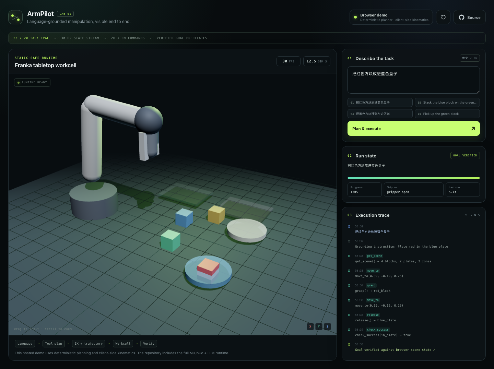
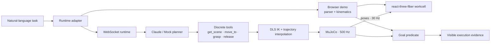
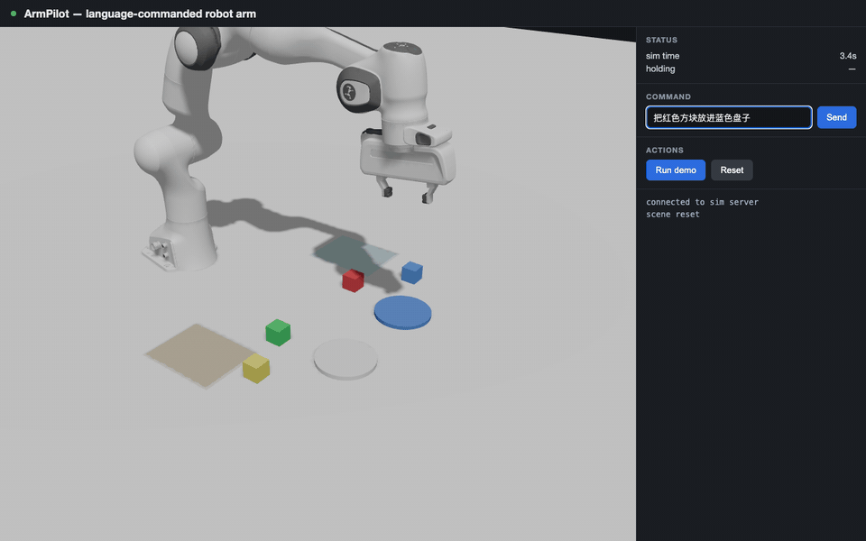

# ArmPilot

**Natural language → discrete tool plan → classical robot control → verified outcome.**

[](https://github.com/Redchar1992/armpilot/actions/workflows/ci-pages.yml)
[](LICENSE)

**[Launch the interactive browser demo →](https://redchar1992.github.io/armpilot/)**



ArmPilot is a physical-AI systems exploration for commanding a Franka Panda in Chinese
or English. An agent grounds the instruction into a small, inspectable tool surface;
classical inverse kinematics and trajectory interpolation execute the motion; a goal
predicate checks simulator state instead of trusting the agent's own answer.

The hosted GitHub Pages build is intentionally backend-free: it runs a deterministic
planner and client-side kinematics so anyone can inspect the complete interaction loop.
The repository also contains the full FastAPI + MuJoCo 3.9 runtime, a Claude tool-calling
planner, a 30 Hz WebSocket renderer, and the 20-task evaluation suite.

## Try the product loop

1. Open the [hosted workspace](https://redchar1992.github.io/armpilot/).
2. Select a Chinese or English example, or enter a supported manipulation command.
3. Watch the execution trace expose `get_scene`, `move_to`, `grasp`, `release`, and
   `check_success` instead of hiding the run behind a spinner.
4. Orbit the 3D workcell while the arm moves and the held-object state updates.
5. Inspect the goal predicate result, task progress, timing, and runtime disclosure.

No API key, backend, account, or installation is required for the hosted demo.

## Two honest runtimes

| Runtime | Where it runs | Planner | Motion | Purpose |
|---|---|---|---|---|
| **Browser demo** | GitHub Pages or local browser | Deterministic bilingual parser | Client-side articulated kinematics | Zero-setup product walkthrough and regression target |
| **MuJoCo live** | Local FastAPI + browser | Claude tool calling or deterministic mock | MuJoCo physics + DLS IK + eased joint trajectories | Full physical-AI execution and evaluation |

The UI selects `Browser demo` by default. Set `NEXT_PUBLIC_RUNTIME=websocket` (and
optionally `NEXT_PUBLIC_WS_URL`) to use the real backend. The product labels the active
runtime at all times; the static demo never pretends to be a remote LLM or MuJoCo run.

## Architecture



The central boundary is deliberate:

> The LLM may choose discrete actions, but it never closes the continuous control loop.

Tool calls are macroscopic (`move_to([x, y, z])`, `grasp()`). In the full runtime,
inverse kinematics and trajectory interpolation are classical code at simulator speed.
An LLM emitting tokens at human-interface latency should not control a 500 Hz loop.

## Full MuJoCo runtime

The real backend streams the compiled Franka workcell to the browser, including raw mesh
data once at initialization and world poses thereafter.

```text
Browser (Next.js 16 + react-three-fiber)
  │
  ├── scene_init: geometry + mesh data
  ├── frame: world poses + holding state @ 30 Hz
  └── status / agent_event / done / error
  │ WebSocket
  ▼
FastAPI
  ├── Agent: ClaudePlanner | MockPlanner
  ├── Tools: get_scene · move_to · grasp · release · check_success
  ├── Control: DLS IK + position actuators + cosine easing
  └── Physics: MuJoCo 3.9 · Franka Panda · 500 Hz timestep
```



*Recorded from the real runtime at roughly 4× speed. Claude reads the scene, plans a
pick-and-place over nine tool calls, executes it, and verifies the block 2 mm from the
plate center.*

## Run locally

### 1. Backend

Python 3.10 or newer:

```bash
cd backend
python3 -m venv .venv
.venv/bin/pip install -r requirements.txt
.venv/bin/uvicorn armpilot.server:app --port 8000
```

### 2. Frontend in MuJoCo mode

Node.js 20.19 or newer:

```bash
cd frontend
npm install
NEXT_PUBLIC_RUNTIME=websocket npm run dev
```

Open <http://localhost:3100>. The default WebSocket endpoint is
`ws://localhost:8000/ws`; override it with `NEXT_PUBLIC_WS_URL`.

For a persistent local configuration, create `frontend/.env.local`:

```dotenv
NEXT_PUBLIC_RUNTIME=websocket
NEXT_PUBLIC_WS_URL=ws://localhost:8000/ws
```

### Planner selection

Without an API key, the deterministic `MockPlanner` handles the supported command
families. With `ANTHROPIC_API_KEY`, the Claude planner accepts free-form phrasing.

```dotenv
# backend/.env (gitignored)
ARMPILOT_PLANNER=claude
ANTHROPIC_API_KEY=...
ARMPILOT_MODEL=claude-fable-5
```

`ANTHROPIC_BASE_URL` is supported for compatible gateways. The Claude planner retries
transient `429` and `503` responses with bounded backoff.

## Supported deterministic commands

| Family | Chinese example | English example |
|---|---|---|
| `in_plate` | 把红色方块放进蓝色盘子 | Put the green block in the white plate |
| `on_block` | 把蓝色方块叠到绿色方块上面 | Stack the red block on the yellow block |
| `in_zone` | 把黄色方块移到左边区域 | Move the red block to the right zone |
| `holding` | 拿起绿色方块 | Pick up the blue block |
| `multi` | 把红色方块和绿色方块都放进白色盘子 | Put the yellow and blue blocks in the blue plate |

## Evaluation and quality gates

The 20 tasks in `backend/tasks/tasks.json` cover all five families. Each result is
verified against simulator ground truth; agent self-reporting is not accepted as proof.

```bash
cd backend
.venv/bin/python -m armpilot.eval --planner mock
```

Current results:

- Mock planner: **20/20 (100%)**.
- Claude planner (`claude-sonnet-4-6` evaluation run): **20/20 (100%)**, about 32 s/task.
- Browser parser: **6 Vitest cases** covering bilingual goals, the complete 20-task corpus,
  multi-object plans, and errors.
- Hosted UX: **6 Chromium E2E cases**, including task completion, active-run reset, recovery, mobile layout,
  console cleanliness, and automated WCAG A/AA checks.
- WebSocket boundary: **4 protocol tests** covering Origin policy and malformed,
  oversized, empty, and unknown messages.
- Dependency audit: **0 known npm vulnerabilities** at the current lockfile.

Run the frontend gate:

```bash
cd frontend
npm run check:all
```

Run the backend protocol tests:

```bash
cd backend
PYTHONPATH=. .venv/bin/python -m unittest discover -s tests -v
```

The GitHub Actions workflow runs both gates, rebuilds with the `/armpilot` repository
base path, checks static asset URLs, and deploys the exported `frontend/out` artifact.

## Security and reliability boundaries

- **Cross-site WebSocket hijacking:** browser `Origin` must be allow-listed via
  `ARMPILOT_ALLOWED_ORIGINS`; native clients without an Origin remain supported.
- **Protocol validation:** only JSON objects with `demo`, `reset`, or bounded non-empty
  `command` messages reach the simulator. Invalid input receives a connection-scoped
  error instead of being broadcast to other clients.
- **Slow consumers:** concurrent sends have a one-second timeout; a throttled tab cannot
  stall the 30 Hz broadcast loop.
- **Command serialization:** one motion or planner job runs at a time.
- **Secret boundary:** API credentials stay in the Python backend and never enter the
  Pages bundle.
- **Hosted disclosure:** GitHub Pages uses the browser runtime and says so explicitly.

## Design trade-offs

- **Weld-assisted grasping.** `grasp()` closes the fingers and activates a MuJoCo weld
  to the nearest block. This trades contact realism for a repeatable language→action
  evaluation. Friction-only tuning is future work.
- **Ground-truth perception.** `get_scene` reads simulator poses; there is no camera or
  VLM. The project isolates planning/control architecture rather than claiming a vision
  stack.
- **Raw mesh streaming.** The backend sends MuJoCo's compiled vertices and faces once,
  so the viewer works with arbitrary MJCF assets without maintaining a parallel GLTF
  export pipeline.
- **Deterministic hosted planner.** The Pages build prioritizes reproducibility and
  accessibility. Real model quality, latency, cost, and availability remain backend
  concerns.

## Next steps

- friction-based grasping and better contact tuning;
- camera observations plus VLM perception;
- LeRobot demonstrations and ACT/diffusion low-level policies behind the same tools;
- durable run traces and side-by-side planner evaluation;
- sim-to-real transfer to a low-cost arm such as SO-101.

## Credits

The Franka Panda model is from
[`google-deepmind/mujoco_menagerie`](https://github.com/google-deepmind/mujoco_menagerie)
(Apache-2.0; Panda meshes BSD-3). Its original license is preserved in
`backend/assets/franka_emika_panda/LICENSE`. ArmPilot adds a `grip_site` TCP site and
removes the upstream keyframe for this workcell; the patch is documented in `panda.xml`.
